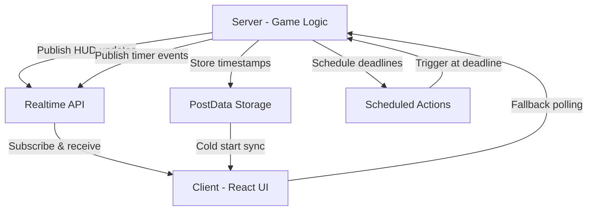

# Design Document — Realtime HUD & Countdowns

## Overview

This design implements a live HUD and countdown system for the Odyssey Protocol game using Devvit's Realtime API. The system provides instant updates to mission statistics (Fuel, Hull, Crew, Success Chance, Science Points) and displays countdown timers for time-boxed phases. The architecture ensures graceful degradation for clients without realtime support while maintaining server authority over all state changes.

### Key Design Principles

1. **Server Authority**: All state changes originate from the server; clients are display-only
2. **Graceful Degradation**: Full functionality with or without realtime support
3. **Drift Correction**: Client timers sync with server time to handle clock skew
4. **Minimal Server Load**: Publish events only on state changes, not every second
5. **Reconnection Resilience**: Automatic recovery from connection interruptions

## Architecture

### High-Level Flow



### Component Layers

1. **Server Layer**: Express routes, game logic, realtime publishers
2. **Realtime Layer**: Devvit's pub/sub channels for live updates
3. **Storage Layer**: PostData for timestamps, Redis for game state
4. **Client Layer**: React components with realtime subscriptions
5. **Fallback Layer**: Polling mechanism for non-realtime clients

## Components and Interfaces

### 1. Realtime Message Types

Located in `src/shared/types/realtime.ts`:

```typescript
// Base message structure
export interface BaseRealtimeMessage {
  mission_id: string;
  ts: number; // Server epoch milliseconds
}

// HUD update message
export interface HudMessage extends BaseRealtimeMessage {
  t: 'hud';
  hud: {
    fuel?: number;
    hull?: number;
    crew?: number;
    success?: number;
    scienceDelta?: number;
    phase?: string;
  };
  full?: boolean; // If true, treat as authoritative snapshot
}

// Timer state message
export interface TimerMessage extends BaseRealtimeMessage {
  t: 'timer';
  timer: {
    kind: 'LAUNCH' | 'BALLOT' | 'PHASE';
    ends_at: string; // ISO 8601
    now?: string; // Server time for drift correction
    status: 'running' | 'paused' | 'ended';
  };
}

// Toast notification (optional)
export interface ToastMessage extends BaseRealtimeMessage {
  t: 'toast';
  message: string;
  severity: 'info' | 'success' | 'warning' | 'error';
}

export type RealtimeMessage = HudMessage | TimerMessage | ToastMessage;
```

### 2. Mission Snapshot API

Located in `src/shared/types/mission.ts`:

```typescript
export interface MissionSnapshotRequest {
  mission_id: string;
}

export interface MissionSnapshotResponse {
  mission_id: string;
  phase: string;
  fuel: number;
  hull: number;
  crew: number;
  success: number;
  science_points_delta: number;
  timers: {
    launch_countdown_until?: string | null;
    choices_open_until?: string | null;
    phase_gate_until?: string | null;
  };
  server_now: string; // ISO 8601
}
```

### 3. PostData Extensions

Add to existing PostData structure:

```typescript
interface MissionPostData {
  // Existing fields...
  
  // New timer fields
  phase_started_at?: string | null; // ISO 8601
  choices_open_until?: string | null; // ISO 8601
  launch_countdown_until?: string | null; // ISO 8601
  phase_gate_until?: string | null; // ISO 8601
}
```

### 4. Server-Side Realtime Service

Located in `src/server/services/realtime.ts`:

```typescript
export class RealtimeService {
  constructor(
    private realtime: RealtimeAPI,
    private redis: RedisClient
  ) {}

  // Publish HUD update
  async publishHudUpdate(
    missionId: string,
    hudData: Partial<HudData>,
    full: boolean = false
  ): Promise<void> {
    const message: HudMessage = {
      t: 'hud',
      mission_id: missionId,
      ts: Date.now(),
      hud: hudData,
      full,
    };
    
    await this.realtime.send(`rt:mission:${missionId}:hud`, message);
  }

  // Publish timer state
  async publishTimerState(
    missionId: string,
    timerKind: TimerKind,
    endsAt: Date,
    status: TimerStatus
  ): Promise<void> {
    const message: TimerMessage = {
      t: 'timer',
      mission_id: missionId,
      ts: Date.now(),
      timer: {
        kind: timerKind,
        ends_at: endsAt.toISOString(),
        now: new Date().toISOString(),
        status,
      },
    };
    
    await this.realtime.send(`rt:mission:${missionId}:timer`, message);
  }

  // Start countdown with scheduled action
  async startCountdown(
    missionId: string,
    timerKind: TimerKind,
    durationMs: number,
    schedulerJobName: string
  ): Promise<void> {
    const endsAt = new Date(Date.now() + durationMs);
    
    // Store in PostData
    await this.storeTimerDeadline(missionId, timerKind, endsAt);
    
    // Schedule server action
    await this.scheduleTimerEnd(missionId, schedulerJobName, endsAt);
    
    // Publish timer start
    await this.publishTimerState(missionId, timerKind, endsAt, 'running');
  }

  private async storeTimerDeadline(
    missionId: string,
    timerKind: TimerKind,
    endsAt: Date
  ): Promise<void> {
    const fieldMap = {
      LAUNCH: 'launch_countdown_until',
      BALLOT: 'choices_open_until',
      PHASE: 'phase_gate_until',
    };
    
    const field = fieldMap[timerKind];
    await this.redis.hSet(
      `mission:${missionId}:postdata`,
      field,
      endsAt.toISOString()
    );
  }

  private async scheduleTimerEnd(
    missionId: string,
    jobName: string,
    endsAt: Date
  ): Promise<void> {
    // Implementation uses Devvit scheduler
    // Store job metadata for later execution
    await this.redis.hSet(
      `mission:${missionId}:scheduled_jobs`,
      jobName,
      JSON.stringify({ endsAt: endsAt.toISOString(), missionId })
    );
  }
}
```

### 5. Client-Side Realtime Hook

Located in `src/client/hooks/useRealtimeHud.ts`:

```typescript
export interface HudState {
  fuel: number;
  hull: number;
  crew: number;
  success: number;
  scienceDelta: number;
  phase: string;
}

export function useRealtimeHud(missionId: string, initialState: HudState) {
  const [hud, setHud] = useState<HudState>(initialState);
  const [lastTs, setLastTs] = useState<number>(0);
  const [isConnected, setIsConnected] = useState<boolean>(false);

  useEffect(() => {
    // Check if realtime is available
    if (!window.devvit?.realtime) {
      console.warn('Realtime not available, using fallback mode');
      return;
    }

    const channel = window.devvit.realtime.subscribe(
      `rt:mission:${missionId}:hud`,
      (message: HudMessage) => {
        // Ignore stale messages
        if (message.ts <= lastTs) return;
        
        setLastTs(message.ts);
        
        // Update HUD state
        setHud(prev => ({
          ...prev,
          ...message.hud,
        }));
      }
    );

    channel.onConnected(() => setIsConnected(true));
    channel.onDisconnected(() => setIsConnected(false));

    return () => channel.unsubscribe();
  }, [missionId]);

  return { hud, isConnected };
}
```

### 6. Client-Side Timer Hook

Located in `src/client/hooks/useRealtimeTimer.ts`:

```typescript
export interface TimerState {
  kind: TimerKind;
  remainingMs: number;
  status: TimerStatus;
  endsAt: Date | null;
}

export function useRealtimeTimer(
  missionId: string,
  timerKind: TimerKind,
  fallbackEndsAt?: string | null
) {
  const [timer, setTimer] = useState<TimerState>({
    kind: timerKind,
    remainingMs: 0,
    status: 'ended',
    endsAt: null,
  });
  
  const [serverOffset, setServerOffset] = useState<number>(0);
  const [isConnected, setIsConnected] = useState<boolean>(false);

  // Local tick interval
  useEffect(() => {
    if (timer.status !== 'running' || !timer.endsAt) return;

    const interval = setInterval(() => {
      const now = Date.now() + serverOffset;
      const remaining = timer.endsAt!.getTime() - now;
      
      setTimer(prev => ({
        ...prev,
        remainingMs: Math.max(0, remaining),
      }));
      
      if (remaining <= 0) {
        setTimer(prev => ({ ...prev, status: 'ended' }));
      }
    }, 100); // Update every 100ms for smooth animation

    return () => clearInterval(interval);
  }, [timer.status, timer.endsAt, serverOffset]);

  // Realtime subscription
  useEffect(() => {
    if (!window.devvit?.realtime) {
      // Fallback mode
      if (fallbackEndsAt) {
        const endsAt = new Date(fallbackEndsAt);
        setTimer({
          kind: timerKind,
          remainingMs: Math.max(0, endsAt.getTime() - Date.now()),
          status: 'running',
          endsAt,
        });
      }
      return;
    }

    const channel = window.devvit.realtime.subscribe(
      `rt:mission:${missionId}:timer`,
      (message: TimerMessage) => {
        if (message.timer.kind !== timerKind) return;
        
        // Calculate drift correction
        if (message.timer.now) {
          const serverTime = new Date(message.timer.now).getTime();
          const localTime = Date.now();
          setServerOffset(serverTime - localTime);
        }
        
        const endsAt = new Date(message.timer.ends_at);
        const now = Date.now() + serverOffset;
        
        setTimer({
          kind: message.timer.kind,
          remainingMs: Math.max(0, endsAt.getTime() - now),
          status: message.timer.status,
          endsAt,
        });
      }
    );

    channel.onConnected(() => setIsConnected(true));
    channel.onDisconnected(() => {
      setIsConnected(false);
      // Switch to fallback
      if (fallbackEndsAt) {
        const endsAt = new Date(fallbackEndsAt);
        setTimer(prev => ({
          ...prev,
          endsAt,
          remainingMs: Math.max(0, endsAt.getTime() - Date.now()),
        }));
      }
    });

    return () => channel.unsubscribe();
  }, [missionId, timerKind, fallbackEndsAt]);

  return { timer, isConnected };
}
```

### 7. HUD Component

Located in `src/client/components/MissionHud.tsx`:

```typescript
export function MissionHud({ missionId, initialState }: Props) {
  const { hud, isConnected } = useRealtimeHud(missionId, initialState);
  
  return (
    <div className="mission-hud">
      <StatBar label="Fuel" value={hud.fuel} max={100} icon="⛽" />
      <StatBar label="Hull" value={hud.hull} max={100} icon="🛡" />
      <StatBar label="Crew" value={hud.crew} max={100} icon="🙂" />
      <StatBar label="Success" value={hud.success} max={100} icon="🎯" />
      <StatDelta label="Science" value={hud.scienceDelta} icon="🧪" />
      
      {!isConnected && (
        <div className="hud-status">Offline Mode</div>
      )}
    </div>
  );
}
```

### 8. Countdown Component

Located in `src/client/components/CountdownTimer.tsx`:

```typescript
export function CountdownTimer({ 
  missionId, 
  timerKind, 
  label,
  fallbackEndsAt 
}: Props) {
  const { timer, isConnected } = useRealtimeTimer(
    missionId, 
    timerKind, 
    fallbackEndsAt
  );
  
  const formatTime = (ms: number): string => {
    const totalSeconds = Math.floor(ms / 1000);
    const minutes = Math.floor(totalSeconds / 60);
    const seconds = totalSeconds % 60;
    return `T−${minutes.toString().padStart(2, '0')}:${seconds.toString().padStart(2, '0')}`;
  };
  
  const getColorClass = (): string => {
    const seconds = timer.remainingMs / 1000;
    if (seconds <= 10) return 'danger blink';
    if (seconds <= 60) return 'warning';
    return 'neutral';
  };
  
  if (timer.status === 'ended') return null;
  
  return (
    <div className={`countdown-timer ${getColorClass()}`}>
      <span className="timer-label">{label}</span>
      <span className="timer-value">{formatTime(timer.remainingMs)}</span>
      {timer.status === 'paused' && <span className="timer-paused">⏸</span>}
    </div>
  );
}
```

## Data Models

### Mission State (Redis)

```
mission:{mission_id}:state
  - phase: string
  - fuel: number
  - hull: number
  - crew: number
  - success: number
  - science_points: number

mission:{mission_id}:postdata
  - phase_started_at: ISO string
  - choices_open_until: ISO string | null
  - launch_countdown_until: ISO string | null
  - phase_gate_until: ISO string | null

mission:{mission_id}:scheduled_jobs
  - {job_name}: JSON { endsAt, missionId }
```

### Realtime Topics

```
rt:mission:{mission_id}:hud
  - HudMessage payloads

rt:mission:{mission_id}:timer
  - TimerMessage payloads

rt:mission:{mission_id}:toast
  - ToastMessage payloads (optional)
```

## Error Handling

### Client-Side Error Scenarios

1. **Realtime Unavailable**
   - Detection: Check `window.devvit?.realtime` on mount
   - Fallback: Use PostData timestamps + local computation
   - Recovery: Automatic when realtime becomes available

2. **Connection Lost**
   - Detection: `onDisconnected` callback
   - Fallback: Switch to local time-based countdown
   - Recovery: `onConnected` callback + snapshot request

3. **Stale Messages**
   - Detection: Compare message `ts` with `lastTs`
   - Handling: Ignore messages with older timestamps
   - Prevention: Server includes monotonic timestamp

4. **Clock Drift**
   - Detection: Compare `message.timer.now` with `Date.now()`
   - Correction: Calculate offset and apply to all time calculations
   - Update: Recalculate on each timer message

### Server-Side Error Scenarios

1. **Scheduled Action Failure**
   - Detection: Try-catch in scheduler handler
   - Logging: Console error with mission_id and timestamp
   - Recovery: Manual intervention or retry logic

2. **Realtime Publish Failure**
   - Detection: Await realtime.send() and catch errors
   - Fallback: State still persists in PostData
   - Recovery: Clients sync on next poll or reconnect

3. **PostData Write Failure**
   - Detection: Try-catch on Redis operations
   - Handling: Return error response to client
   - Recovery: Retry or manual correction

## Testing Strategy

### Unit Tests

1. **RealtimeService**
   - Test HUD message publishing
   - Test timer message publishing
   - Test scheduled action creation
   - Mock Redis and Realtime API

2. **useRealtimeHud Hook**
   - Test state updates on messages
   - Test stale message filtering
   - Test connection state tracking
   - Mock realtime subscriptions

3. **useRealtimeTimer Hook**
   - Test drift correction calculation
   - Test local tick updates
   - Test fallback mode
   - Test pause/resume states

4. **Countdown Formatting**
   - Test T−mm:ss format
   - Test edge cases (0, negative, large values)
   - Test color class logic

### Integration Tests

1. **End-to-End Timer Flow**
   - Start countdown on server
   - Verify client receives and displays
   - Wait for expiration
   - Verify scheduled action executes
   - Verify client updates to ended state

2. **Reconnection Flow**
   - Start countdown
   - Simulate disconnect
   - Verify fallback mode
   - Simulate reconnect
   - Verify sync with snapshot

3. **Multi-Timer Scenario**
   - Start launch countdown
   - Start ballot countdown
   - Verify both display correctly
   - Verify independent expiration

### Manual Testing Scenarios

1. **Drift Correction**
   - Set system clock +5 minutes
   - Start countdown
   - Verify countdown shows correct remaining time

2. **Network Interruption**
   - Start countdown
   - Disable network for 10 seconds
   - Re-enable network
   - Verify countdown resumes accurately

3. **Multiple Clients**
   - Open mission in two browsers
   - Trigger HUD update
   - Verify both clients update simultaneously

4. **Fallback Mode**
   - Disable realtime in browser
   - Start countdown
   - Verify countdown still functions
   - Verify periodic refreshes

## Performance Considerations

### Server-Side

1. **Publish Frequency**
   - Only publish on state changes, not every second
   - Batch multiple stat changes into single HUD message
   - Use `full: true` sparingly (phase transitions only)

2. **Scheduled Actions**
   - Limit to 10 concurrent per installation (Devvit limit)
   - Clean up completed actions
   - Use cron for recurring checks (ballot auto-close)

3. **Redis Operations**
   - Use pipelining for multiple writes
   - Cache frequently accessed data
   - Use appropriate data structures (hashes for PostData)

### Client-Side

1. **Animation Performance**
   - Use CSS transitions for smooth stat changes
   - Debounce rapid updates (250ms lerp)
   - Use requestAnimationFrame for countdown ticks

2. **Memory Management**
   - Unsubscribe from channels on unmount
   - Clear intervals on cleanup
   - Avoid memory leaks in state updates

3. **Render Optimization**
   - Memoize countdown formatting
   - Use React.memo for HUD components
   - Avoid unnecessary re-renders

## Security Considerations

1. **Server Authority**
   - All state changes originate server-side
   - Client cannot publish to realtime topics
   - Validate all API requests

2. **Message Validation**
   - Include mission_id in every message
   - Use timestamps to prevent replay attacks
   - Validate message structure on client

3. **Rate Limiting**
   - Limit snapshot API requests per user
   - Throttle realtime subscriptions
   - Monitor for abuse patterns

## Deployment Considerations

1. **Feature Flag**
   - Add `realtime: true` to devvit.json
   - Graceful degradation if disabled
   - Monitor adoption metrics

2. **Backward Compatibility**
   - Existing missions work without timers
   - PostData fields are optional
   - Fallback mode ensures universal support

3. **Monitoring**
   - Log realtime connection rates
   - Track message delivery latency
   - Alert on scheduled action failures

## Future Enhancements

1. **Toast Notifications**
   - Implement `rt:mission:{id}:toast` topic
   - Show ephemeral messages ("+3 SP awarded")
   - Auto-dismiss after timeout

2. **Animation Effects**
   - Particle effects on stat increases
   - Pulse animation on critical events
   - Smooth transitions between phases

3. **Sound Effects**
   - Audio cues for countdown milestones
   - Alert sounds at T−10 seconds
   - Success/failure sounds

4. **Advanced Drift Correction**
   - Use multiple samples for accuracy
   - Detect and handle time jumps
   - Adaptive correction algorithm
