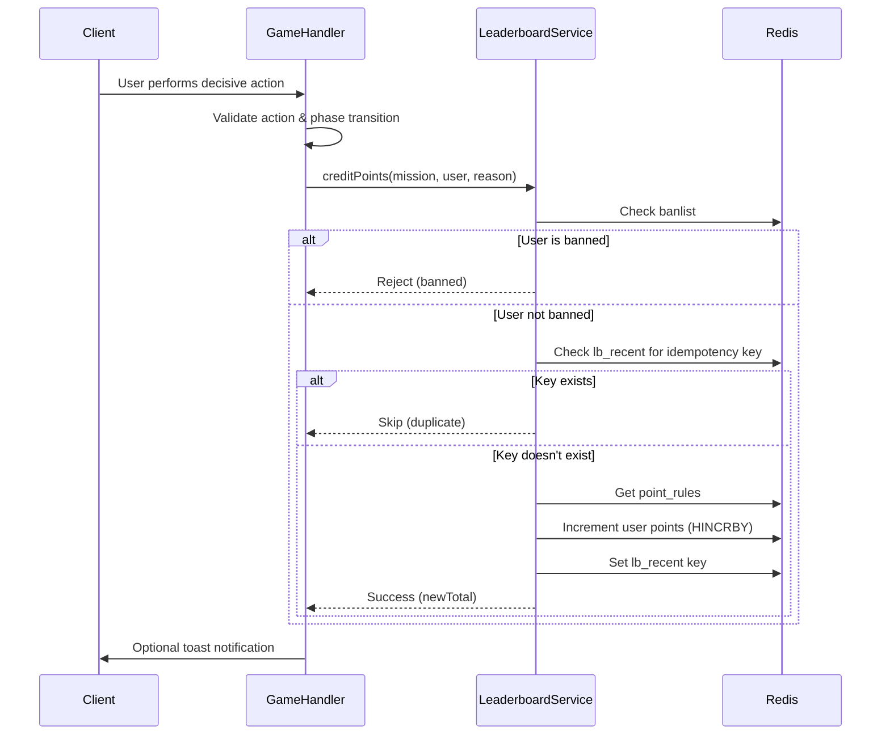
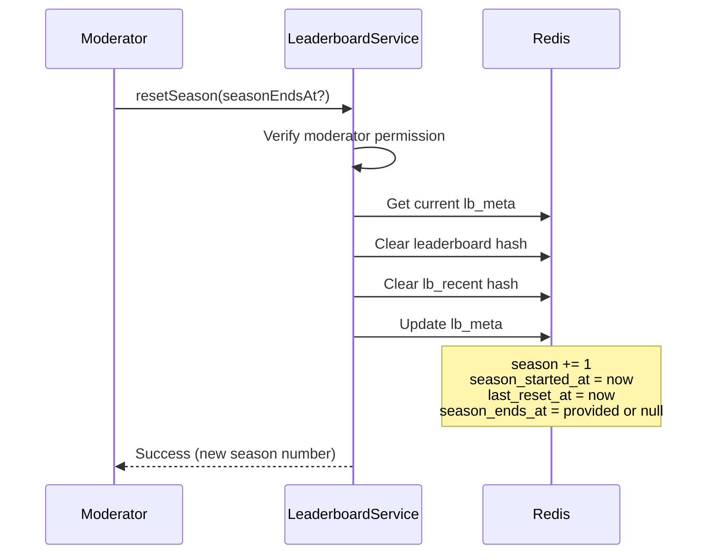

# Design Document — User Leaderboards

## Overview

The User Leaderboards feature provides a comprehensive point tracking and ranking system for the Odyssey Protocol game. It awards points for meaningful player actions (decisive choices, mission participation), displays rankings through a modal UI, and supports seasonal resets with moderation capabilities. The system is designed to prevent abuse through idempotency guarantees and server-side validation.

## Architecture

### High-Level Architecture

```
┌─────────────────────────────────────────────────────────────┐
│                        Client Layer                          │
│  ┌──────────────────┐  ┌──────────────────────────────────┐ │
│  │ Leaderboard      │  │ Game Action Handlers             │ │
│  │ Button & Modal   │  │ (Decisive Actions, Mission End)  │ │
│  └────────┬─────────┘  └──────────────┬───────────────────┘ │
│           │                            │                      │
└───────────┼────────────────────────────┼──────────────────────┘
            │ GET /api/leaderboard/*     │ POST (server-side)
            │                            │
┌───────────┼────────────────────────────┼──────────────────────┐
│           │         Server Layer       │                      │
│  ┌────────▼─────────┐        ┌────────▼──────────────────┐  │
│  │ Leaderboard      │        │ Mission Event Handlers    │  │
│  │ Routes           │        │ (Award Points)            │  │
│  └────────┬─────────┘        └────────┬──────────────────┘  │
│           │                            │                      │
│  ┌────────▼────────────────────────────▼──────────────────┐  │
│  │          LeaderboardService                            │  │
│  │  - creditPoints()                                      │  │
│  │  - bulkCreditPoints()                                  │  │
│  │  - getTopN()                                           │  │
│  │  - getPersonalRank()                                   │  │
│  │  - resetSeason()                                       │  │
│  │  - banUser()                                           │  │
│  └────────┬───────────────────────────────────────────────┘  │
│           │                                                   │
│  ┌────────▼───────────────────────────────────────────────┐  │
│  │              Redis Storage Layer                       │  │
│  │  - leaderboard: { username → points }                 │  │
│  │  - lb_meta: { season, dates, banlist, point_rules }   │  │
│  │  - lb_recent: { idempotency_key → timestamp }         │  │
│  └────────────────────────────────────────────────────────┘  │
└─────────────────────────────────────────────────────────────┘
```

### Design Principles

1. **Server-Side Authority**: All point calculations and credits occur server-side to prevent client manipulation
2. **Idempotency**: Each credit operation is idempotent using composite keys (mission + user + reason)
3. **Atomic Operations**: Redis operations ensure consistency under concurrent access
4. **Separation of Concerns**: Service layer handles business logic, routes handle HTTP concerns
5. **Reusable Patterns**: Follow existing GalleryService pattern for consistency

## Components and Interfaces

### 1. Storage Schema

The leaderboard uses three Redis keys for flat, efficient storage:

#### `leaderboard` (Hash)

```typescript
{
  "u_alice": "42",
  "u_bob": "38",
  "u_charlie": "55"
}
```

#### `lb_meta` (JSON String)

```typescript
{
  season: number;                    // Current season number (starts at 1)
  season_started_at: string;         // ISO 8601 datetime
  season_ends_at: string | null;     // ISO 8601 datetime or null
  last_reset_at: string | null;      // ISO 8601 datetime or null
  banlist: string[];                 // Array of banned usernames
  point_rules: {
    ACTION_DECISIVE: number;         // Default: 3
    MISSION_SUCCESS: number;         // Default: 5
    MISSION_FAIL: number;            // Default: 1
    MISSION_ABORT: number;           // Default: 1
    VOTE_PARTICIPATION: number;      // Default: 1 (optional)
  };
}
```

#### `lb_recent` (Hash)

```typescript
{
  "OP-001:u_alice:ACTION_DECISIVE": "2025-10-29T12:00:00Z",
  "OP-001:u_bob:MISSION_SUCCESS": "2025-10-29T12:05:00Z"
}
```

**Key Format**: `{mission_id}:{username}:{reason}`

### 2. LeaderboardService

Following the GalleryService pattern, this service encapsulates all leaderboard business logic.

```typescript
export class LeaderboardService {
  private redis: any;
  private reddit: any;
  private context: any;

  constructor(redis: any, reddit: any, context: any);

  // Initialization
  async initializeStorage(): Promise<void>;

  // Point Operations
  async creditPoints(
    missionId: string,
    username: string,
    reason: CreditReason,
    points?: number
  ): Promise<CreditResult>;

  async bulkCreditPoints(
    missionId: string,
    usernames: string[],
    reason: CreditReason,
    points?: number
  ): Promise<BulkCreditResult>;

  // Query Operations
  async getTopN(n: number): Promise<LeaderboardEntry[]>;
  async getPersonalRank(username: string): Promise<PersonalRank>;

  // Moderation Operations
  async resetSeason(seasonEndsAt?: string): Promise<SeasonResetResult>;
  async banUser(username: string, ban: boolean): Promise<BanResult>;

  // Internal Helpers
  private async getLeaderboard(): Promise<Record<string, number>>;
  private async saveLeaderboard(data: Record<string, number>): Promise<void>;
  private async getMetadata(): Promise<LeaderboardMetadata>;
  private async saveMetadata(meta: LeaderboardMetadata): Promise<void>;
  private async getRecentCredits(): Promise<Record<string, string>>;
  private async saveRecentCredits(recent: Record<string, string>): Promise<void>;
  private buildIdempotencyKey(missionId: string, username: string, reason: string): string;
  private async isUserBanned(username: string): Promise<boolean>;
  private async checkModeratorPermission(username: string): Promise<boolean>;
}
```

### 3. Type Definitions

```typescript
// Credit Reasons
export type CreditReason =
  | 'ACTION_DECISIVE'
  | 'MISSION_SUCCESS'
  | 'MISSION_FAIL'
  | 'MISSION_ABORT'
  | 'VOTE_PARTICIPATION';

// Leaderboard Entry
export interface LeaderboardEntry {
  username: string;
  points: number;
  rank: number;
}

// Personal Rank Response
export interface PersonalRank {
  username: string;
  points: number;
  rank: number | null; // null if banned or no points
  banned?: boolean;
}

// Credit Result
export interface CreditResult {
  ok: boolean;
  newTotal: number;
  message?: string;
}

// Bulk Credit Result
export interface BulkCreditResult {
  ok: boolean;
  updated: number;
  skipped: string[]; // Usernames that were skipped (banned or duplicate)
}

// Season Reset Result
export interface SeasonResetResult {
  ok: boolean;
  season: number;
  message?: string;
}

// Ban Result
export interface BanResult {
  ok: boolean;
  username: string;
  banned: boolean;
  message?: string;
}

// Metadata Structure
export interface LeaderboardMetadata {
  season: number;
  season_started_at: string;
  season_ends_at: string | null;
  last_reset_at: string | null;
  banlist: string[];
  point_rules: {
    ACTION_DECISIVE: number;
    MISSION_SUCCESS: number;
    MISSION_FAIL: number;
    MISSION_ABORT: number;
    VOTE_PARTICIPATION: number;
  };
}
```

### 4. API Routes

All routes follow the `/api/leaderboard/*` pattern:

#### POST `/api/leaderboard/credit` (Server-Side Only)

**Purpose**: Award points to a single user for a specific action  
**Auth**: Internal server calls only (not exposed to client)  
**Request Body**:

```typescript
{
  mission_id: string;
  username: string;
  reason: CreditReason;
  points?: number;  // Optional override
}
```

**Response**:

```typescript
{
  ok: boolean;
  newTotal: number;
  message?: string;
}
```

#### POST `/api/leaderboard/bulk-credit` (Server-Side Only)

**Purpose**: Award points to multiple users simultaneously  
**Auth**: Internal server calls only  
**Request Body**:

```typescript
{
  mission_id: string;
  usernames: string[];
  reason: CreditReason;
  points?: number;
}
```

**Response**:

```typescript
{
  ok: boolean;
  updated: number;
  skipped: string[];
}
```

#### GET `/api/leaderboard/top?n=10`

**Purpose**: Retrieve top N ranked users  
**Auth**: Any authenticated user  
**Query Parameters**:

- `n`: Number of entries (default: 10, max: 100)

**Response**:

```typescript
{
  entries: LeaderboardEntry[];
  season: number;
  season_started_at: string;
  season_ends_at: string | null;
}
```

#### GET `/api/leaderboard/me`

**Purpose**: Get current user's rank and points  
**Auth**: Any authenticated user  
**Response**:

```typescript
{
  username: string;
  points: number;
  rank: number | null;
  banned?: boolean;
}
```

#### POST `/api/leaderboard/reset` (Moderator Only)

**Purpose**: Reset leaderboard for new season  
**Auth**: Moderator required  
**Request Body**:

```typescript
{
  season_ends_at?: string;  // Optional end date for new season
}
```

**Response**:

```typescript
{
  ok: boolean;
  season: number;
  message?: string;
}
```

#### POST `/api/leaderboard/ban` (Moderator Only)

**Purpose**: Ban or unban a user from leaderboard  
**Auth**: Moderator required  
**Request Body**:

```typescript
{
  username: string;
  ban: boolean; // true to ban, false to unban
}
```

**Response**:

```typescript
{
  ok: boolean;
  username: string;
  banned: boolean;
  message?: string;
}
```

### 5. Client Components

#### LeaderboardButton

A persistent button visible in all game phases that opens the leaderboard modal.

**Props**:

```typescript
interface LeaderboardButtonProps {
  onClick: () => void;
}
```

**Behavior**:

- Always visible in game UI
- Opens LeaderboardModal on click
- Shows notification badge for new achievements (optional)

#### LeaderboardModal

A modal dialog displaying leaderboard information with tabs and moderation controls.

**Props**:

```typescript
interface LeaderboardModalProps {
  isOpen: boolean;
  onClose: () => void;
  currentUsername: string;
  isModerator: boolean;
}
```

**State**:

```typescript
interface LeaderboardModalState {
  activeTab: 'top' | 'me';
  topEntries: LeaderboardEntry[];
  personalRank: PersonalRank | null;
  seasonInfo: {
    season: number;
    started_at: string;
    ends_at: string | null;
  };
  loading: boolean;
  error: string | null;
}
```

**Tabs**:

1. **Top Tab**: Displays top N users with ranks, usernames, points, and badges
2. **Me Tab**: Shows personal rank, points, and distance to top 10

**Moderator Controls** (visible only to moderators):

- Reset Season button (with confirmation dialog)
- Ban User input and button (with confirmation)

#### LeaderboardRow

A single row in the leaderboard display.

**Props**:

```typescript
interface LeaderboardRowProps {
  rank: number;
  username: string;
  points: number;
  isCurrentUser?: boolean;
}
```

**Display**:

```
#1  🥇 u_alice     55 pts
#2  🥈 u_charlie   42 pts
#3  🥉 u_bob       38 pts
#4  🎖 u_dave      30 pts
```

**Badges**:

- 🥇 Rank 1
- 🥈 Rank 2
- 🥉 Rank 3
- 🎖 Ranks 4-10

## Data Models

### Point Credit Flow



### Rank Computation

Ranks are computed on-demand using the following algorithm:

```typescript
function computeRank(username: string, leaderboard: Record<string, number>): number {
  const userPoints = leaderboard[username] || 0;

  let rank = 1;
  for (const [user, points] of Object.entries(leaderboard)) {
    if (points > userPoints) {
      rank++;
    } else if (points === userPoints && user < username) {
      // Tie-breaker: alphabetical order
      rank++;
    }
  }

  return rank;
}
```

For Top N queries, entries are sorted:

1. By points descending
2. By username ascending (tie-breaker)

### Season Reset Flow



## Error Handling

### Validation Errors

1. **Missing Required Fields**: Return 400 with descriptive message
2. **Invalid Credit Reason**: Return 400 with valid reasons list
3. **Invalid Username Format**: Return 400 with format requirements
4. **Negative Points**: Return 400 (points must be non-negative)

### Authorization Errors

1. **Moderator Required**: Return 403 with "Moderator permission required"
2. **User Not Found**: Return 401 with "Unable to verify user"
3. **Banned User**: Return 200 with `ok: false` and message (not an error, expected behavior)

### Storage Errors

1. **Redis Connection Failure**: Return 500 with "Storage unavailable"
2. **Corrupted Data**: Log error, attempt recovery, return 500 if unrecoverable
3. **Concurrent Modification**: Redis atomic operations prevent this

### Idempotency Handling

Duplicate credit attempts are not errors—they return success with the existing total:

```typescript
{
  ok: true,
  newTotal: 42,  // Unchanged
  message: "Credit already applied"
}
```

## Testing Strategy

### Unit Tests

1. **LeaderboardService.creditPoints()**

   - Awards correct points for each reason
   - Rejects banned users
   - Enforces idempotency
   - Uses default point values when not specified
   - Uses custom point values when specified

2. **LeaderboardService.bulkCreditPoints()**

   - Credits multiple users correctly
   - Skips banned users
   - Enforces idempotency per user
   - Returns accurate updated count

3. **LeaderboardService.getTopN()**

   - Returns correct number of entries
   - Sorts by points descending
   - Applies username tie-breaker
   - Excludes banned users

4. **LeaderboardService.getPersonalRank()**

   - Computes correct rank
   - Returns null rank for banned users
   - Handles users with zero points
   - Handles non-existent users

5. **LeaderboardService.resetSeason()**

   - Clears all points
   - Increments season number
   - Preserves banlist
   - Preserves point_rules
   - Sets correct timestamps

6. **LeaderboardService.banUser()**
   - Adds user to banlist
   - Removes user from banlist
   - Prevents banned users from earning points
   - Hides banned users from rankings

### Integration Tests

1. **End-to-End Credit Flow**

   - Decisive action → credit → verify points
   - Mission success → bulk credit → verify all participants
   - Duplicate action → verify no double credit

2. **Concurrent Credit Operations**

   - Multiple users credit simultaneously
   - Same user credited from multiple sources
   - Verify final totals are correct

3. **Season Reset Integration**

   - Reset season → verify clean slate
   - New credits go to new season
   - Old season data is cleared

4. **Moderator Workflow**
   - Ban user → verify exclusion
   - Reset season → verify new season
   - Unban user → verify inclusion

### Manual Testing Scenarios

1. **Decisive Action Award**

   - User triggers phase transition
   - Verify +3 points awarded
   - Verify toast notification (if implemented)
   - Verify leaderboard updates

2. **Mission Completion**

   - Mission succeeds with 5 participants
   - Verify all 5 users get +5 points
   - Verify leaderboard reflects changes

3. **Leaderboard UI**

   - Open modal from any phase
   - Switch between Top and Me tabs
   - Verify correct data display
   - Verify moderator controls (if moderator)

4. **Ban and Reset**
   - Ban a user
   - Verify they disappear from Top
   - Verify they can't earn points
   - Reset season
   - Verify clean leaderboard

## Integration Points

### Game Action Handlers

The leaderboard integrates with existing game logic at these points:

#### 1. Decisive Actions (Phase Transitions)

When a user action triggers a phase change:

```typescript
// In your phase transition handler
async function handleDecisiveAction(missionId: string, username: string) {
  // Existing phase transition logic...

  // Award points for decisive action
  await leaderboardService.creditPoints(missionId, username, 'ACTION_DECISIVE');
}
```

#### 2. Mission Result Phase

When a mission reaches RESULT phase:

```typescript
// In your mission result handler
async function handleMissionResult(missionId: string, outcome: 'success' | 'fail' | 'abort') {
  // Get list of participating users (users who took actions during mission)
  const participants = await getParticipatingUsers(missionId);

  // Determine credit reason
  const reason =
    outcome === 'success'
      ? 'MISSION_SUCCESS'
      : outcome === 'fail'
        ? 'MISSION_FAIL'
        : 'MISSION_ABORT';

  // Bulk credit all participants
  await leaderboardService.bulkCreditPoints(missionId, participants, reason);
}
```

#### 3. Vote Participation (Optional)

If implementing micro-points for any valid action:

```typescript
// In your action validation handler
async function handleUserAction(missionId: string, username: string, action: any) {
  // Validate action...

  // Award participation point (rate-limited by idempotency)
  await leaderboardService.creditPoints(missionId, username, 'VOTE_PARTICIPATION');
}
```

### Participant Tracking

To support bulk credits, track participating users during a mission:

```typescript
// Add to mission state (in Redis or memory)
interface MissionState {
  mission_id: string;
  participants: Set<string>; // Usernames who acted
  // ... other mission state
}

// When user performs any valid action
function recordParticipant(missionState: MissionState, username: string) {
  missionState.participants.add(username);
}

// At mission end
async function creditParticipants(missionState: MissionState, outcome: string) {
  const usernames = Array.from(missionState.participants);
  const reason = outcomeToReason(outcome);

  await leaderboardService.bulkCreditPoints(missionState.mission_id, usernames, reason);
}
```

### Client Toast Notifications (Optional)

After server confirms credit, show a local toast:

```typescript
// Client-side after successful action
async function handleAction() {
  const response = await fetch('/api/game/action', { ... });

  if (response.ok) {
    // Server awarded points (or not, due to idempotency)
    showToast('+3 pts for Decisive Action');
  }
}
```

**Important**: Never calculate or display points client-side. Only show notifications after server confirmation.

## Performance Considerations

### Redis Operations

1. **Atomic Increments**: Use `HINCRBY` for point updates (O(1))
2. **Hash Storage**: Leaderboard as hash for O(1) lookups
3. **Batch Operations**: Bulk credits use pipelining where possible
4. **Rank Computation**: O(n) where n = total users (acceptable for <10k users)

### Optimization Strategies

1. **Top N Caching**: Cache top 10 for 30 seconds (optional)
2. **Rank Caching**: Cache personal rank for 60 seconds (optional)
3. **Lazy Loading**: Load leaderboard data only when modal opens
4. **Pagination**: Limit Top N to max 100 entries

### Scalability Limits

- **Users**: Efficient up to ~10,000 active users per season
- **Credits**: Unlimited (idempotency prevents duplicates)
- **Seasons**: Unlimited (old season data is cleared)

If scaling beyond 10k users, consider:

- Sorted sets (ZADD/ZRANGE) for O(log n) rank computation
- Separate rank cache with periodic updates
- Sharding by season or subreddit

## Security Considerations

### Server-Side Validation

1. **All credits server-side**: Client cannot trigger credit operations directly
2. **Moderator verification**: Use Reddit API to verify mod status
3. **Input sanitization**: Validate all usernames and mission IDs
4. **Rate limiting**: Optional rate limits on credit operations

### Anti-Abuse Measures

1. **Idempotency**: Prevents duplicate credits for same action
2. **Banlist**: Moderators can exclude abusive users
3. **Point rules**: Configurable to adjust incentives
4. **Audit trail**: `lb_recent` provides credit history

### Data Privacy

1. **Public data**: All leaderboard data is public within the subreddit
2. **Username only**: No PII beyond Reddit username
3. **Moderator actions**: Logged via Reddit's moderation log

## Deployment Considerations

### Initialization

On app install or first run:

```typescript
await leaderboardService.initializeStorage();
```

This creates:

- Empty `leaderboard` hash
- `lb_meta` with season 1 and default point rules
- Empty `lb_recent` hash

### Migration

If adding to existing app:

1. Run initialization (safe, checks for existing data)
2. No data migration needed (fresh start)
3. Optionally import historical data if available

### Configuration

Point rules can be adjusted without redeployment:

```typescript
// Update point rules via admin endpoint or direct Redis update
const meta = await leaderboardService.getMetadata();
meta.point_rules.ACTION_DECISIVE = 5; // Increase from 3 to 5
await leaderboardService.saveMetadata(meta);
```

### Monitoring

Key metrics to track:

1. **Credit operations**: Count and latency
2. **Top N queries**: Frequency and response time
3. **Season resets**: Frequency and impact
4. **Ban operations**: Frequency and affected users
5. **Storage size**: Monitor `leaderboard` and `lb_recent` growth

## Future Enhancements

### Phase 2 Features (Not in Current Scope)

1. **Historical Seasons**: Archive past season data for viewing
2. **Achievements**: Badge system for milestones
3. **Team Leaderboards**: Track subreddit vs subreddit
4. **Point Decay**: Time-based point reduction for inactive users
5. **Leaderboard Tiers**: Bronze/Silver/Gold divisions
6. **Export**: Download leaderboard as CSV
7. **Notifications**: Alert users when they enter top 10
8. **Season Schedules**: Automatic resets on schedule

### API Extensions

1. **GET `/api/leaderboard/history`**: View past seasons
2. **GET `/api/leaderboard/user/:username`**: View any user's stats
3. **POST `/api/leaderboard/adjust`**: Manual point adjustment (mod only)
4. **GET `/api/leaderboard/stats`**: Aggregate statistics

## Appendix: File Structure

```
src/
├── server/
│   ├── index.ts                    # Mount leaderboard routes
│   ├── routes/
│   │   └── leaderboard.ts          # API route handlers
│   └── services/
│       └── leaderboard.ts          # LeaderboardService class
├── client/
│   └── components/
│       ├── LeaderboardButton.tsx   # Button to open modal
│       ├── LeaderboardModal.tsx    # Main modal component
│       └── LeaderboardRow.tsx      # Single leaderboard entry
└── shared/
    └── types/
        └── leaderboard.ts          # Shared type definitions
```
